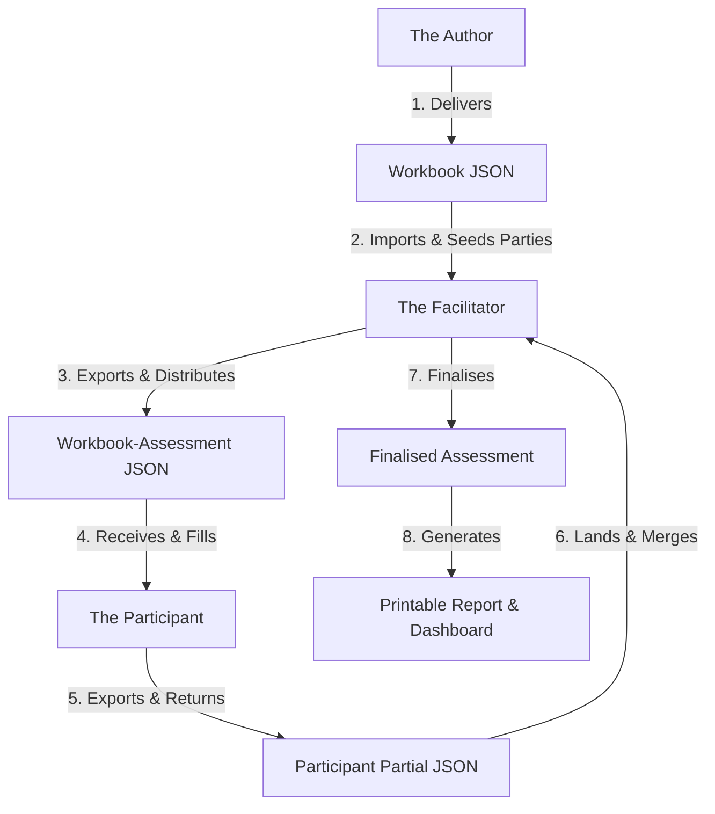

# Self-Assessment Workshop Process

This guide describes how to run a Cloud Sovereignty self-assessment workshop. The process uses four distinct file types to pass data between the facilitator and participants.

## File Lifecycle

The table below describes the four files in the self-assessment lifecycle:

| File | Creator | What it Contains | Next Step |
|---|---|---|---|
| **Workbook** | Author | The questions, objectives, rungs, and recommendations. | The facilitator imports this file to start. |
| **Workbook-Assessment** | Facilitator | The workbook, the name of the estate, and seeded parties. | Sent to all workshop participants. |
| **Partial** | Participant | One participant's name, claims, answers, and evidence. | Sent back to the facilitator. |
| **Finalized Assessment** | Facilitator | The merged estate answers, resolved clashes, and the ledger. | Becomes the official assessment record. |

## Step 1: Assessment Setup (Facilitator)

The facilitator prepares the assessment before the workshop:

1. Open the **Assessment** application.
2. Load the **Workbook** JSON file.
3. Open the **Setup** section.
4. Enter the name of the cloud estate.
5. Add the assessed organisation as the primary party.
6. Add known third-party providers and select the dimensions they serve.
7. Click **Export workbook-assessment** to save the file.

## Step 2: Participant Fill (Participant)

Each participant records their own knowledge during the workshop:

1. Open the **Assessment** application and load the **Workbook-Assessment** JSON file.
2. Enter your name on the **Overview** tab.
3. Open **Parties** to add any missing third-party providers.
4. Open **Claims** and click **+ Claim** to declare what you can speak for. Select your roles and any specific dimensions or parties.
5. Open **Current Question**.
6. Place each unit (dimension chip or party chip) onto the correct ladder rung.
7. Use **Nobody knows** if your team does not know the answer. Use **Doesn't apply** only if the question cannot apply to that unit.
8. Add a concise evidence note (for example, contract clauses or audit reports) to support high-SEAL answers.
9. Click **Export partial** and return your file to the facilitator.

## Step 3: Reconcile and Land (Facilitator)

The facilitator merges participant files to build the estate record:

1. Open the **Assessment** application.
2. Load the **Workbook-Assessment** file, then click **Add partial** for each returned file.
3. **Reconcile Parties:** Resolve duplicate third-party names. Combine identical providers to clean up the exposure map.
4. **Resolve Clashes:** Resolve disagreements on each unit:
   * **Divergence:** Different rungs chosen for the same unit.
   * **Gap:** An answer conflicts with a "Nobody knows" state.
   * **Scope:** An answer conflicts with a "Doesn't apply" state.
   * **Grain:** A whole-dimension answer conflicts with stratum-specific answers.
5. Click **Land** to save the partial to the append-only ledger.

## Step 4: Finalise and Report (Facilitator)

Once all partials land, the facilitator exports the results:

1. Open the **Dashboard** to review the overall estate readings.
2. Review the **Staircase** to see which answers bind the SEAL floor and what changes would lift it.
3. Review the **Exposure Map** to see which third parties serve critical dimensions.
4. Click **Export final assessment** to save the complete record.
5. Click **Print report** to open the browser print flow and generate the printable leave-behind report.
