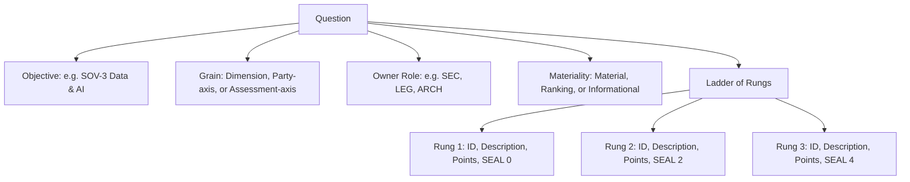

# Workbook Authoring Guide

An **Instrument** (or **Workbook**) is a self-assessment configuration file. Authors build and edit workbooks in the **Author** application. 

This guide describes how to author a sovereignty question and configure a valid instrument.

## The Core Principle: Write Control Facts

Every question rouses a simple, core enquiry:

> **If things go wrong, do you still control your resources? Or can an outside party read your data, or stop your service?**

Therefore, every ladder rung must state a checkable **capability-under-stress fact**. Rungs must not describe general maturity, policies, or certifications.

## Seven Decisions to Write a Question

To write a question, you must make seven key decisions:

### 1. Select the Objective
Each question belongs to one **Sovereignty Objective** (SOV-1 to SOV-8). Objectives have distinct weights (for example, SOV-3 has a weight of 10). Objectives group questions on the dashboard and printable reports.

### 2. Write the Question Stem
Write exactly one askable sentence. The stem must be answerable out loud in a workshop. Do not use "and" to join two separate facts; instead, split them into two separate questions.

### 3. Write the "Why" Explanation
Explain what the answer changes. The facilitator reads this sentence aloud to the room.
*Example:* *"Whoever holds the keys decides under stress whether data is protected or merely stored."*

### 4. Choose the Grain
Determine how the question fans out:
* **Dimension Grain:** Asked once for every applicable dimension (for example, Compute, Storage, or IAM).
* **Party Grain (Assessment-axis):** Asked once for the entire estate (for example, "Is there an exit strategy?").
* **Party Grain (Party-axis):** Asked once for each concrete provider (for example, "Can this provider be compelled?").

### 5. Build the Ladder
A **Ladder** is an ordered set of rungs, worst to best. Going up, points and SEAL tags must never decrease.
* **Sparse Ladders:** You do not need a rung for every SEAL level. If no intermediate state exists, omit that level.
* **Repeated SEALs:** Multiple rungs can share the same SEAL tag. This is useful when points rise (ranking changes) but the gate remains the same.

### 6. Assign the Owner Role
Pick the specific role in the room that has the correct knowledge (for example, `SEC` for security, `LEG` for legal, or `ARCH` for architecture).

### 7. Set the Materiality
Define how the engine uses the answers:
* **Material:** Answers earn points and gate the overall SEAL floor. (This is the default).
* **Ranking:** Answers earn points but never gate the SEAL floor. Use this when the top rung is currently unreachable due to external blockers.
* **Informational:** Answers are recorded but do not affect scores or gates.

## Workbook Concepts Reference Guide

A workbook author must configure several connected components to create an instrument. The sections below define each concept that the authoring application uses. Read these definitions to understand the schema and the rules for each component.

### Workbook Configuration
The workbook is the root file that defines the full scope of an assessment. It contains metadata, a front sheet, SEAL level definitions, dimensions, roles, party types, objectives, test estates, and optional recommendations. Authors create and edit this file in the Author application as a single self-contained document.

### Objectives
Objectives represent weighted themes inherited from the European Commission framework. Each objective has a unique id, a name, a description, and a numerical weight. The sum of all objective weights in a workbook must equal 100. Every question in the workbook must link to exactly one objective.

### Questions
Questions are the individual units that participants answer during an assessment. Each question has a unique id, a text stem, an explanation, an owner role, a grain, and an answer ladder. If a question uses dimension grain, you must set the appliesTo field with target dimension identifiers. The system validates that each question links to a valid role and objective.

### Ladders and Rungs
A rung is a single answer choice that describes an observable operational state. Each rung contains an id, a plain description, a point value, and a SEAL level from 0 to 4. A ladder groups these rungs in order from lowest to highest sovereignty. Participants select the rung that matches their facts, and the engine calculates points and gates from that selection.

### Grains
The grain controls how many times participants must answer a question. Assessment grain questions apply once to the whole estate for general policies and plans. Party grain questions repeat for each declared supplier to evaluate vendor risk. Dimension grain questions repeat across each technical layer to evaluate infrastructure controls.

### Dimensions and Strata
Dimensions represent the technical layers of the cloud estate, such as compute, storage, network, and security. Critical dimensions gate the overall SEAL floor, while non-critical dimensions contribute points without gating. Strata are sub-layers inside a dimension, such as service, software, hardware, and chips. If an answer differs across sub-layers, the application splits the dimension into strata so that participants answer each sub-layer.

### Party Types
Party types define the categories of organisations in the supply chain. Each workbook must define one assessed party type for the institution that owns the estate. The workbook also defines third-party types for contractors, subcontractors, and hardware or software suppliers. This taxonomy allows the assessment to trace dependencies past the primary contracting entity.

### Roles
Roles identify the domain experts who attend the assessment workshop. Common roles include ARCH for architecture, OPS for operations, SEC for security, LEG for legal, and PROC for procurement. Every question must name one owner role. The application groups questions by role so that the right people answer each item.

### Materiality
Materiality sets the effect that an answer has on points and floor gates. Material questions earn points and gate the SEAL floor for critical controls. Ranking questions earn points but never gate the SEAL floor, which helps when supply chains block the top rung. Informational questions collect environmental or regulatory data without changing scores or gates.

### Test Estates
Test estates are pre-set answer profiles that serve as a quality assurance test rig. When you edit an instrument, the engine re-evaluates all test estates immediately. This process reveals if a change allows a low-sovereignty estate to score too high. It also reveals if an edit causes an unexpected drop in a high-sovereignty estate score.

### Recommendations
Recommendations provide remediation guidance when an estate scores below a target level. The recommender section names the author organisation, provides a disclosure statement, and adds a contact link. Each recommendation defines an action, descriptive text, a time horizon, and a trigger level named whenAtOrBelow. If the evaluated floor for a linked objective falls at or below that trigger, the dashboard displays the recommendation.
