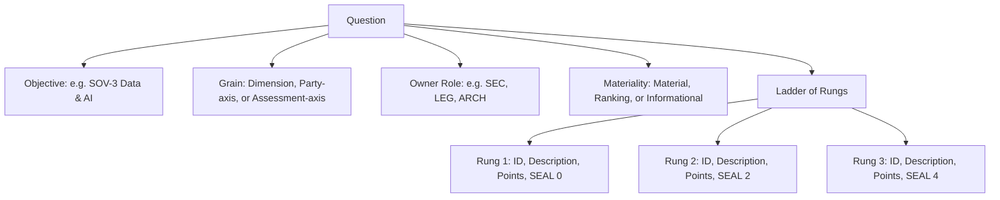

# Workbook Authoring Guide

An **Instrument** (or **Workbook**) is a self-assessment configuration file. Authors build and edit workbooks in the **Author** application. 

This guide describes how to author a sovereignty question and configure a valid instrument.

## The Core Principle: Write Control Facts

Every question rouses a simple, core enquiry:

> **If things go wrong, do you still control your resources? Or can an outside party read your data, or stop your service?**

Therefore, every ladder rung must state a checkable **capability-under-stress fact**. Rungs must not describe general maturity, policies, or certifications.

## Seven Decisions to Write a Question

To write a question, you must make seven key decisions:

### 1. Select the Objective
Each question belongs to one **Sovereignty Objective** (SOV-1 to SOV-8). Objectives have distinct weights (for example, SOV-3 has a weight of 10). Objectives group questions on the dashboard and printable reports.

### 2. Write the Question Stem
Write exactly one askable sentence. The stem must be answerable out loud in a workshop. Do not use "and" to join two separate facts; instead, split them into two separate questions.

### 3. Write the "Why" Explanation
Explain what the answer changes. The facilitator reads this sentence aloud to the room.
*Example:* *"Whoever holds the keys decides under stress whether data is protected or merely stored."*

### 4. Choose the Grain
Determine how the question fans out:
* **Dimension Grain:** Asked once for every applicable dimension (for example, Compute, Storage, or IAM).
* **Party Grain (Assessment-axis):** Asked once for the entire estate (for example, "Is there an exit strategy?").
* **Party Grain (Party-axis):** Asked once for each concrete provider (for example, "Can this provider be compelled?").

### 5. Build the Ladder
A **Ladder** is an ordered set of rungs, worst to best. Going up, points and SEAL tags must never decrease.
* **Sparse Ladders:** You do not need a rung for every SEAL level. If no intermediate state exists, omit that level.
* **Repeated SEALs:** Multiple rungs can share the same SEAL tag. This is useful when points rise (ranking changes) but the gate remains the same.

### 6. Assign the Owner Role
Pick the specific role in the room that has the correct knowledge (for example, `SEC` for security, `LEG` for legal, or `ARCH` for architecture).

### 7. Set the Materiality
Define how the engine uses the answers:
* **Material:** Answers earn points and gate the overall SEAL floor. (This is the default).
* **Ranking:** Answers earn points but never gate the SEAL floor. Use this when the top rung is currently unreachable due to external blockers.
* **Informational:** Answers are recorded but do not affect scores or gates.
