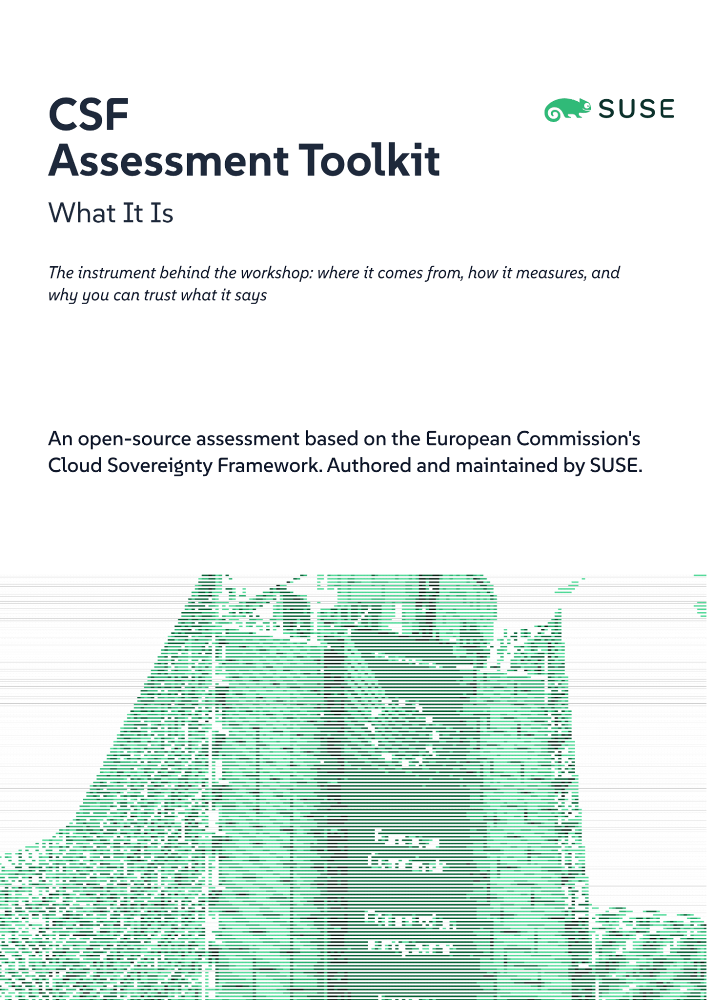
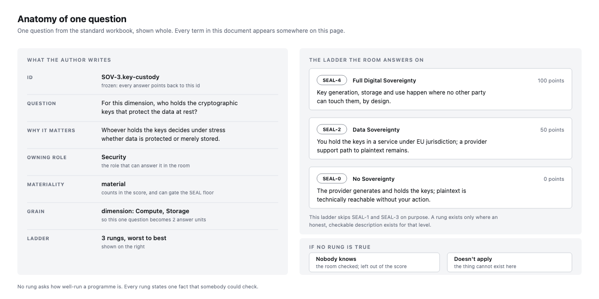
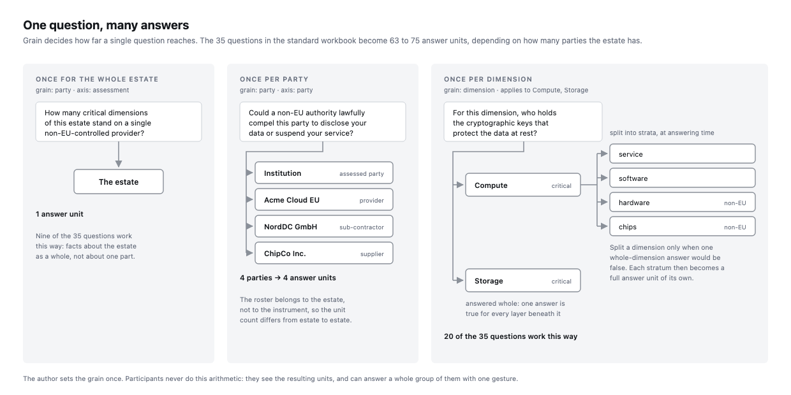
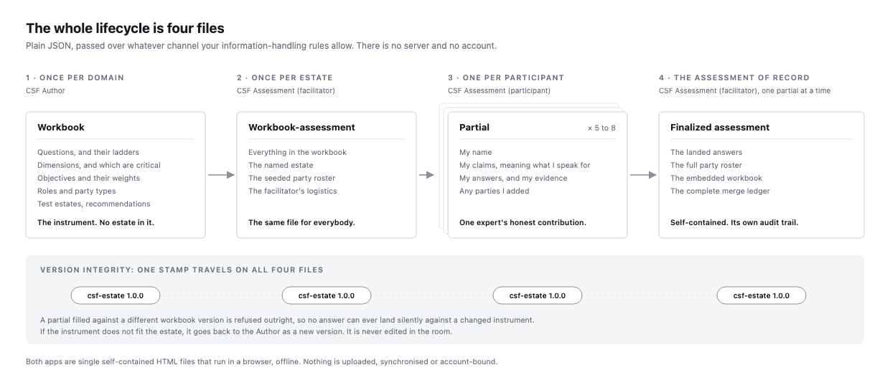
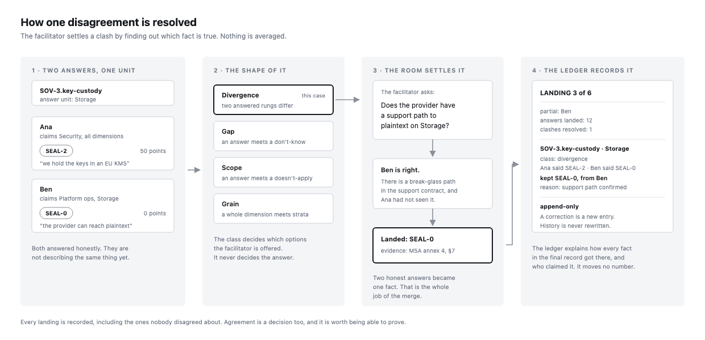
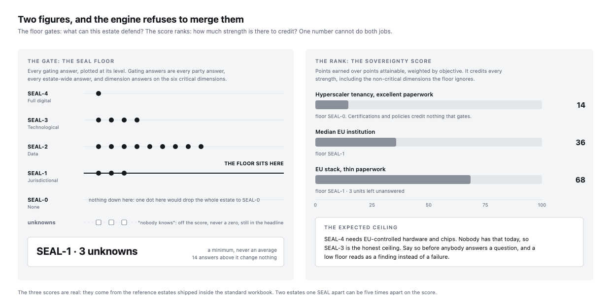

## 1. The European Commission Cloud Sovereignty Framework

In October 2025 the European Commission (EC) published its Cloud Sovereignty Framework (version 1.2.1), the methodology it uses to rank cloud suppliers bidding for EU procurement. It defines eight sovereignty objectives, a five-level assurance scale, and a scoring model that keeps two figures apart: how sovereign an offer is, and how well it ranks against alternatives. The framework came first and on its own. The Implementation guidance and its Annex, the sovereignty assessment calculator, followed on 1 June 2026. Together they spell out the 48 criteria, how each one is scored, and how each maps to an assurance level.

The EC material is treated as good practice to cite and, where necessary, to diverge from openly — never as a conformance target. Completing this assessment is not an EU certification and does not claim to be one.

## 2. The missing pieces

What the Commission publishes is a reference. The Annex is one finished spreadsheet holding the 48 criteria, their scoring and their SEAL mapping. It states what a good assessment contains. It does not help anybody build or run one. The CSF Assessment Toolkit exists for the parts that are left to you.

Authoring an assessment for a domain. The spreadsheet assumes an author who already holds the whole subject in their head and will transcribe it into cells correctly. Nothing checks the result. Nothing warns that an answer option grades how well-run a programme is instead of stating a control fact, that a ladder skips a level for no honest reason, that a weight no longer sums, or that the set has grown past what a room can answer in one sitting.

Turning depth of analysis into questions. The guidance is clear that an assessment must reach across every dimension, into the strata beneath it, and out along the chain of parties. It stops there. It does not say how that instruction becomes questions, or how the answers land in a spreadsheet without being flattened. Here, reach is a property of a question. An author sets a question's grain, and the question fans out by itself: once for the estate, once per party, or once per dimension, with any dimension splittable into strata at answering time. Depth stops being the author's bookkeeping problem.

Filling one questionnaire with many experts. No single person knows an estate's law, contracts, architecture, operations, security and facilities. The Commission's material says nothing about how several experts answer one questionnaire, or how their answers become one record. Spreadsheets passed around a room produce a pile of versions and no single record. The toolkit makes that the main event: every participant works in their own copy, claims what they can genuinely speak for, and exports a partial. The facilitator then lands each partial one at a time, and every conflict is resolved out loud rather than by averaging.

Honesty without an evaluating authority. In procurement, a supplier's submission is checked by somebody with the power to reject it. A self-assessment has no such authority, so the pressure to read well has to be removed by construction rather than by review. That is why "nobody knows" is a first-class answer excluded from the score, why every answer carries who claimed it and what backs it up, and why every merge decision lands in an append-only ledger. Section 5 covers this in full.

The room is the evaluator, and the estate is the object. Two consequences follow. The assessment covers a whole estate rather than one legal entity, so its technical dimensions and the concrete parties standing under them are assessed together. And the conversation that produces the numbers matters as much as the numbers, because the disagreements are the map of where the organization does not yet know itself.

## 3. Where the questions come from

An assessment does not invent its own questions. It runs an instrument: a question set written beforehand, by a domain expert, for a whole domain rather than for your organization. Your half day is spent answering the questions. Designing them is separate work, done by somebody else, at another time.

The framework already works this way. The Commission published its criteria so that any authority buying cloud infrastructure could reuse them instead of writing its own. The questions describe the domain. They say nothing about any particular buyer. The toolkit carries that further and gives the instrument a version, a named owner and a lifecycle of its own.

The three terms this document uses for reach come from the guidance as well, from its depth of analysis.

Dimensions are the technical areas an estate is built from, such as compute, storage, network, IAM, security and facilities, and the ones a critical service rests on are flagged critical.
Strata are the layers inside a dimension, so compute splits into service, software, hardware and chips, which is what keeps sovereign software running on foreign-controlled silicon visible.
Parties are the legal entities behind the estate: the assessed organization, its providers, and the sub-contractors and suppliers standing behind them, all of which the guidance requires you to follow past the entity that signed the contract. (European Commission, Cloud Sovereignty Framework implementation guidance, "Depth of analysis".)

Cloud infrastructure is only the first domain. Asking who controls a technology, whose law applies to it and what survives when access breaks is in no way particular to IaaS or PaaS, so an instrument can be commissioned for any domain where those questions matter: ERP, payroll, clinical systems, industrial control, telco, managed AI services. The cloud instrument ships ready to run, and any other instrument loads the same way. Anyone can author one for their own domain with the same tools.

Keeping the instrument separate from the assessment is what makes the results usable. The instrument is fixed for the day, so the room argues about facts instead of wording. And because every organization on that version answers the same questions, the numbers compare: against your own estate a year later, and against anyone else who assessed the same domain. A spreadsheet edited per engagement can offer none of that.

That separation is what the CSF Assessment Toolkit is built around, and it runs all the way down to the software. The toolkit is two tools, and the line between them is the line between the instrument and the assessment. CSF Author writes an instrument for a domain, once, long before any workshop. CSF Assessment runs an assessment against one estate, and covers the whole day: setup, filling, merging and the readout. Neither carries questions of its own. Section 7 describes both.

## 4. Anatomy of one question

Everything the assessment does rests on the shape of a single question. Read one closely and the rest of this document is mostly vocabulary.

A question is one sentence. It has to be askable out loud and answerable by one person: *who holds the cryptographic keys that protect the data at rest?* Alongside it the author writes down why it matters, so the room does not argue about the wording, and the role that owns it, meaning the knowledge-owner who can answer it. The standard workbook names six roles: Architecture, Platform Operations, Security, Legal, Procurement, and Facilities/ESG.

The answers are a ladder of descriptions. Each question carries a ladder of ordered rungs, worst to best. A rung is a plain-language description, a point value, and a SEAL level. Participants pick the description that is true; the level and the points follow from it. Nobody ever picks a number.

Every rung states a control fact. Who holds the keys, whose law applies, what keeps running after a withdrawal. No rung asks how mature or well-documented a programme is, because a well-managed dependency is still a dependency. Certifications and policies score only where a rung actually asks about them.

Ladders may skip levels. The example ladder has three rungs, at SEAL-0, SEAL-2 and SEAL-4. SEAL-1 and SEAL-3 are absent because no honest description exists for them here. A rung invented to fill the gap would be one nobody could truthfully pick.

Materiality says how the answer is used.Material* answers count in the score and can gate the headline level. *Ranking* answers count in the score but never gate. *Informational* answers are recorded and reported but affect neither. The standard workbook ships 31 material questions and four informational ones: all three environmental questions and the certification question.

## 5. One question, many answers

The guidance requires an assessment to reach across every dimension, into the layers beneath it, and out along the chain of parties. It does not say how. Here that reach is a property of the question: the author sets its grain, and the question fans out by itself into answer units.

Once for the whole estate. Some facts belong to the estate and to nothing smaller: *how many critical dimensions stand on a single non-EU-controlled provider?* Nine of the 35 questions work this way, and each becomes exactly one answer unit.

Once per party.Parties are the legal entities behind the estate: the assessed institution, its providers, and the sub-contractors and suppliers standing behind them. Six questions are asked once per party, so the unit count depends on the roster, which belongs to the estate and not to the instrument. Questions like *could a non-EU authority lawfully compel this party?* have to be asked of each organization separately, because the answers differ.

Once per dimension.Dimensions are the technical areas an estate is built from. Twenty questions are asked once per dimension they apply to. A dimension may be split into its strata, the layers inside it, and then each stratum becomes a full answer unit of its own. Split only when one whole-dimension answer would be false. Sovereign software running on foreign-controlled chips is the case this exists for, and strata are never a way to average a weak layer away.

Nobody has to do this arithmetic. Participants see the units their claims give them, and one gesture can answer a whole group of them at once, so 63 to 75 units still fit inside a 90-minute slot. (European Commission, Cloud Sovereignty Framework implementation guidance, "Depth of analysis".)

## 6. What the standard workbook covers

Everything in the assessment serves one underlying question: if things go wrong, do you still control your estate, or can someone far away read your data or pull the plug? The cloud instrument breaks that into 35 questions, grouped and weighted as the EC weights them. The count is small on purpose. Every question must be answerable in the room, in the time slot, by the person who owns the knowledge.

| Objective                            | Weight | Questions |
| ---------------------------------------- | ---------- | ------------- |
| SOV-1 Strategic Sovereignty              | 20%        | 3             |
| SOV-2 Legal & Jurisdictional Sovereignty | 10%        | 3             |
| SOV-3 Data & AI Sovereignty              | 10%        | 6             |
| SOV-4 Operational Sovereignty            | 15%        | 6             |
| SOV-5 Supply Chain Sovereignty           | 10%        | 5             |
| SOV-6 Technology Sovereignty             | 15%        | 4             |
| SOV-7 Security & Compliance Sovereignty  | 15%        | 5             |
| SOV-8 Environmental Sustainability       | 5%         | 3             |

Ten dimensions carry the technical half. Six ship flagged critical, meaning a weakness there caps the whole estate. The EC guidance names five of those as the least it would expect; the standard workbook adds platform.

| Dimension                 | Critical | Strata                                   |
| ----------------------------- | ------------ | -------------------------------------------- |
| Compute                       | yes          | service, software, hardware, chips           |
| Storage                       | yes          | service, software, hardware, chips           |
| Network                       | yes          | service, software, hardware, chips           |
| IAM                           | yes          | identity, access                             |
| Platform (containers, PaaS)   | yes          | service, software                            |
| Security                      | yes          | SIEM service, SIEM software, threat, XDR/EDR |
| AI/ML platform                | no           | service, software                            |
| Software supply & development | no           | service, software                            |
| Edge (DDoS, CDN, DNS)         | no           | DDoS, CDN, DNS                               |
| Facilities (power, estate)    | no           | power, cooling, building                     |

The other half interrogates the concrete organizations in the chain. Can this provider be compelled by a non-EU authority? Would your contract survive its acquisition? Could you enforce a judgment against it? Could its staff obtain privileged access without your approval? Each party also records the dimensions it serves, and those links draw the exposure map.

Cloud infrastructure is only the first domain. An instrument can be commissioned for any domain where control, jurisdiction and survivability matter, and it loads into the same tools.

## 7. Answering: what one person contributes

A participant fills in the part of the questionnaire they can honestly speak for.

Claims come first. A claim is a declaration of what you speak for: one or more roles, optionally narrowed to named dimensions or parties (*"Security, for Compute and Network"*). Claims filter your view down to exactly your units, and they travel with your answers, so the final record carries both the assertion and the authority behind it. Claims are additive, and several narrow honest claims beat one broad one.

Then four states scored distinctly.Answered*: the chosen rung's description is true here. *Nobody knows*: asserted ignorance, meaning the room checked and the answer is unavailable. It is excluded from the score, never counted as zero, and it stays visible in the headline. *Doesn't apply*: the thing asked about cannot exist for this unit, with an optional reason. *Unanswered*: no assertion yet, which is incomplete. Guessing therefore costs a participant more than admitting.

Evidence is optional and never scored. Any answered unit can carry a note naming what backs it up: a contract clause and version, an audit report and date, an exit-rehearsal result. Evidence moves no point and no level. It makes the answer defensible before a reviewer, and the report counts how much of the assessment carries it.

## 8. The four files, and the two apps that make them

The toolkit is two self-contained HTML applications that run entirely in a browser, offline. Both are open source. Nothing is uploaded, synchronized or account-bound, which is a deliberate property for an assessment whose content is itself sensitive.

CSF Author writes an instrument for a domain, once, long before any workshop, with live quality checks: control-fact linting, coverage and time-budget gauges, and reference estates that re-evaluate on every edit. CSF Assessment runs an assessment against one estate and covers the whole day: setup, filling, merging and the readout. It serves the facilitator and the participants alike, switching behaviour based on the file loaded into it. Neither app carries questions of its own.

Version integrity is enforced. A partial filled against a different workbook version is refused outright, so answers can never silently land against a changed instrument. If the instrument does not fit the estate, it goes back to the Author as a new version; it is never edited in the room.

## 9. Merging: one disagreement at a time

No single person knows an estate's law, contracts, architecture, operations, security and facilities. Several partials therefore have to become one record, which is the step a shared spreadsheet cannot do.

Landing is atomic and sequential. The facilitator reviews one partial, resolves everything in it, and commits it. The estate record changes once. A discarded partial lands nothing, and a later correction lands as a new entry.

Party identities are reconciled first. Are "Acme" and "Acme Cloud EU" the same organization or two? The app proposes candidate pairs; only the facilitator merges them, and a merge unions the served dimensions and rewrites the affected answers onto the surviving identity. Getting this wrong would silently split or fuse the exposure map, so it happens before any answer is touched.

Then every clash is settled as a question of fact.

A clash comes in one of four shapes. A divergence is two answered rungs that differ. A gap is an answer meeting a don't-know. A scope clash is an answer meeting a doesn't-apply. A grain clash is a whole-dimension answer meeting stratum answers. The class decides which options the facilitator is offered. It never decides the answer. That is settled by finding out which fact is true. The facilitator does not average the two, and does not reach for the lower number by reflex.

Every decision lands in an append-only ledger, including the uncontested ones. Corrections are new entries and history is never rewritten, so the finalized file explains how each fact in it got there and who claimed it. The record is its own audit trail, and the ledger influences no score.

## 10. The two numbers, and the four readouts

The engine produces two figures and refuses to collapse them into one.

The SEAL floor gates. It is the minimum level over every gating answer: every party answer, every estate-wide answer, and dimension and stratum answers on the six critical dimensions. It answers one question: *what level can this estate actually defend?*One SEAL-0 answer on a critical dependency floors the whole estate, because under stress that is exactly what happens. The floor is always reported with its unknowns, as in "SEAL-2 · 3 unknowns", so an admitted gap stays visible and never scores as a zero.

The Sovereignty Score ranks. Points earned over points attainable, per objective, weighted into a 0-100 figure. It credits every strength, including on the non-critical dimensions the floor ignores, so two estates at the same floor are still distinguishable and improvement between assessments is measurable. In the reference estates shipped inside the standard workbook, an EU stack with thin paperwork scores 68 while a hyperscaler tenancy with excellent paperwork scores 14. That is nearly five times the score, one SEAL level apart. Read either figure on its own and you will misread the estate.

Set the expected ceiling before anyone answers. SEAL-4 is out of reach for virtually every organization today, because the hardware and chip strata of compute, storage and network depend on non-EU supply, and the European Commission says so in its own lessons learnt. SEAL-3 is the practical ceiling. A low floor with its binding answers named is a useful result, and it should be presented that way.

Four explanatory views carry the workshop readout. The heat map grids objectives against dimensions, showing where the estate is strong, weak or silent. The staircase names the exact answers that pin the floor, and where the floor would move to if each one were lifted. That makes it the post-workshop worklist. The exposure map connects each concrete party to the dimensions it serves, coloured by its worst answer, so you can see which compellable organization stands under which critical layer. The credibility block reports evidence coverage, admitted unknowns and claim coverage, describing how defensible the numbers are without changing any of them.

## 11. Why the numbers resist flattery

A supplier's procurement submission is checked by somebody with the power to reject it. A self-assessment has no such authority, so the design has to remove the pressure to read well. Every mechanism above does part of that job, and between them they guard two named failure modes.

A ceiling-leak is where excellent paperwork lets a foreign-dependent estate climb. It is closed by rungs that state control facts and by a floor that only critical, material answers can gate. That is why the well-documented hyperscaler tenancy scores 14 and floors at SEAL-0. A floor-trap is where a genuinely sovereign estate reads badly for missing documents. It is closed by keeping evidence out of the arithmetic and by making "nobody knows" cost nothing but visibility.

Both are checked on every edit. Test estates are reference estates authored into the workbook with known expected results, and they re-evaluate against the real engine whenever the instrument changes, so an edit that would shift a floor or a score announces itself long before it reaches a customer workshop.

The same rule applies to anything commercial. A recommendation is an offer authored into the workbook and linked to specific questions, dimensions or objectives. It appears only when a linked answered fact sits at or below its threshold, and it moves no score and no level. Every recommendation is displayed with its recommender and that recommender's disclosure. In the standard workbook that is SUSE, which authored the instrument and states so alongside every offer.

One thing follows from all of it. The room is the evaluator, so the conversation that produces the numbers matters as much as the numbers. The disagreements are the map of where the organization does not yet know itself.

## Appendix: every term, in one line

Grouped by theme, with the section that explains it.

People.Author: the domain expert who owns the instrument and delivers one versioned workbook (§3, §8). Facilitator: the process owner and merge authority; prepares the assessment, distributes it, resolves every clash, exports the record, and never answers for the room (§8, §9). Participant: an expert who claims part of the assessment, answers it, and defends those answers (§7). Role: one of the answering perspectives the instrument names; the standard workbook ships six (§4).

The instrument.Workbook: the complete versioned instrument, and the definition of what one assessment covers (§8). Objective: one of the eight weighted sovereignty themes inherited from the EU framework (§6). Question: one askable sentence with a reason, an owning role, a materiality and a ladder (§4). Ladder: the ordered rungs of one question, worst to best, levels skippable (§4). Rung: one answer option, being a description, a point value and a SEAL level (§4). SEAL: Sovereignty Effective Assurance Level, the EU framework's five-step scale running from SEAL-0 *No Sovereignty* to SEAL-4 *Full Digital Sovereignty*. It is a property of an answer, and participants never pick one directly (§4). Materiality: whether an answer scores, gates, both or neither (§4). Grain: what one question fans out over (§5). Front sheet: the declarations every participant reads before answering, covering what the assessment includes, what "don't know" means here, the expected ceiling, and the pre-work to bring (§10). Test estate: a reference estate with known expected results, re-evaluated on every instrument change (§11).

The estate.Estate: the named object of the assessment, being the landscape the organization actually runs, with everything that delivers it (§6). Dimension: a technical area of the estate; ten in the standard workbook (§6). Critical dimension: one whose weakness caps the whole estate; six ship critical (§6, §10). Stratum: a layer within one dimension, split only when one whole-dimension answer would be false (§5). Party type: a workbook-authored category of organization; exactly one type marks the assessed institution (§6). Party: a real named organization in this estate's chain, with its type and the dimensions it serves (§5, §6). Assessed party: the one concrete party representing the institution; seeded by the facilitator, never added by a participant, never a risk row (§6).

Answering.Claim: a participant's declaration of what they speak for, optionally narrowed to dimensions or parties (§7). Answer unit: the atom of the assessment, one question at one target, where a target is the estate, one party, one dimension or one stratum (§5). Answer states: *answered*, *nobody knows*, *doesn't apply*, *unanswered* (§7). Evidence: an optional note naming what backs an answer up; never scored (§7).

Merging.Merge: landing each contribution into the shared record, one at a time (§9). Party reconciliation: deciding whether two recorded parties are the same organization, before any answer is touched (§9). Clash: a disagreement on one unit, in one of four shapes, being divergence, gap, scope and grain (§9). Landing: the atomic act of committing one reviewed partial (§9). Merge ledger: the append-only history of every landing and every decision inside it (§9).

Results.SEAL floor: the minimum over every gating answer, always reported with its unknown count (§10). Sovereignty Score: the 0-100 ranking figure, weighted per objective (§10). Heat map: objectives against dimensions (§10). Staircase: the answers that pin the floor, and where the floor moves if each one is lifted (§10). Exposure map: each party connected to the dimensions it serves, coloured by its worst answer (§10). Credibility block: evidence coverage, unknowns and claim coverage, changing no number (§10). Recommendation: a linked, threshold-gated offer, shown with its recommender and disclosure, moving nothing (§11).

Files.Workbook: the Author's output, the instrument with no estate in it. Workbook-assessment: the Facilitator's setup output, being the workbook plus the named estate and its seeded roster. Every participant receives this one file. Partial: one participant's export, holding their name, claims, answers, evidence, and any parties they added. Finalized assessment: the Facilitator's final export and the assessment of record, holding the landed answers, the full roster, the embedded workbook and the complete ledger in one self-contained file (§8).

*A companion document, the Workshop Manual, describes how to prepare, run, and follow up on an assessment: the Author, Facilitator, and Participant roles, the half-day agenda, and the post-workshop use of the results.*
