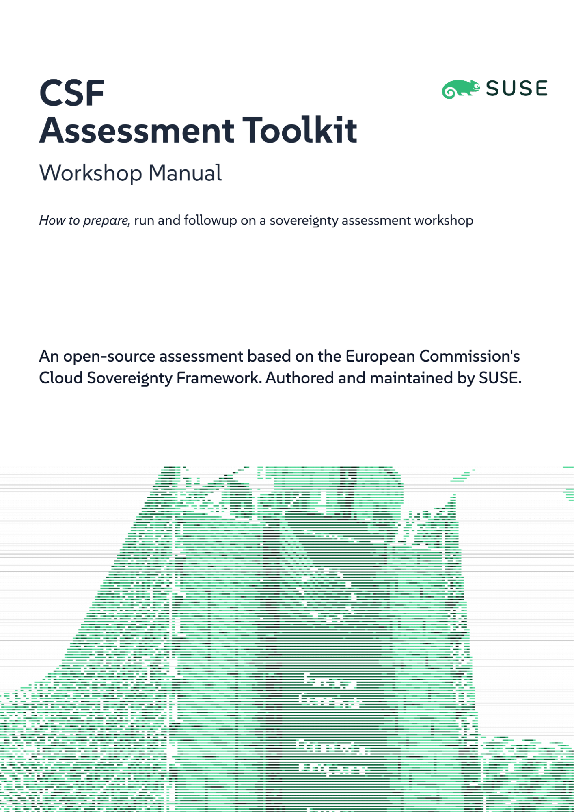
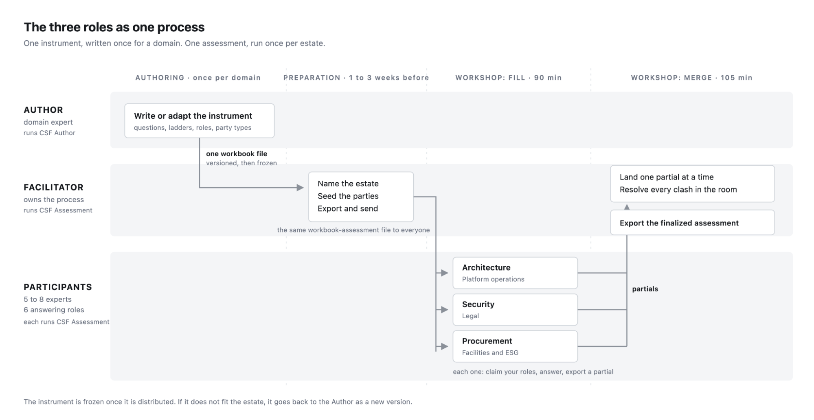

## 1. What this workshop does

The Cloud Sovereignty Framework (CSF) Assessment is a structured, risk-based review of the cloud and infrastructure estate your organization already runs, examined through the lens of digital sovereignty: who controls the technology, whose law applies to it, and what still works when access breaks. It adapts the European Commission's Cloud Sovereignty Framework and implementation guidance, originally built to rank suppliers in procurement, into a self-assessment your own experts complete together in a single half-day workshop, or more separately over a longer period of time.

The workshop produces two headline results that are deliberately kept apart:

- The SEAL floor — the sovereignty level the estate can actually defend, set by its weakest material answer (SEAL-0 *No Sovereignty* up to SEAL-4 *Full Digital Sovereignty*). It is a minimum, not an average: one critical dependency floors the whole estate, because that is how dependencies behave under stress. The floor is always reported together with its count of admitted unknowns.
- The Sovereignty Score — a 0–100 ranking figure that credits every strength across eight weighted objectives, so two estates with the same floor can still be told apart and progress is visible between assessments. Not every question feeds it the same way. Questions marked ranking earn points but never gate the floor. Questions marked informational are recorded and reported, but they earn no points and gate nothing.

Just as important as the numbers is the conversation that produces them. The instrument is designed to surface disagreement between your legal, procurement, architecture, operations, security, and facilities perspectives and to resolve it in the room, on the record.

Set expectations early: per the European Commission's own lessons learnt, SEAL-4  remains out of reach for virtually every organization today, because the hardware and chip layers of compute, storage, and network depend on non-EU supply. A low floor with its binding causes is the *useful* result of this workshop, not a failure.

## 2. Where the questions come from

The workshop does not invent its own questions. It runs an instrument: a question set written beforehand, by a domain expert, for a whole domain rather than for your organization. Your half day is spent answering the questions. Designing them is separate work, done by somebody else, at another time

That is how the source framework already works. The European Commission wrote the Cloud Sovereignty Framework to compare suppliers bidding for one contract, then published it so that any authority buying cloud infrastructure could reuse the same questions. The questions describe the domain. They say nothing about any particular buyer.

How deep an assessment has to go is inherited from the same place. The Commission's implementation guidance sets out a depth of analysis: ask across every dimension and every technical layer so that hidden dependencies and supply chains surface, and never stop at the legal entity that signed the contract. Three terms used throughout this manual come from there.

Dimensions are the technical areas an estate is built from, such as compute, storage, network, IAM, security and facilities; the ones a critical service rests on are flagged critical, and the guidance names compute, storage, network, security and IAM as the least it would expect.

Strata are the layers inside a dimension, so compute, storage and network are each split into service, software, hardware and chips, which is what keeps sovereign software running on foreign-controlled silicon visible.

Parties are the legal entities behind the estate: the assessed organization, its providers, and the sub-contractors and suppliers standing behind them, all of which the guidance requires you to follow.

Cloud infrastructure is only the first domain. Asking who controls a technology, whose law applies to it and what survives when access breaks is in no way particular to IaaS/PaaS, so an instrument can be commissioned for any domain where those questions matter: ERP, payroll, clinical systems, industrial control, telco, managed AI services. The cloud instrument ships are ready to run, and any other instrument can be loaded in the same way.

Separating the instrument from the assessment is what makes the results usable. The instrument is fixed for the day, so the room argues about facts instead of wording. And because every organization using that version answers the same questions, the numbers can be compared: against your own estate a year later, and against anyone else who assessed the same domain.

The split runs all the way down to the software. There are two standalone tools, downloaded and run offline:

- CSF Author writes an instrument for a domain. It is used once per instrument, long before any workshop.
- CSF Assessment runs an assessment against one estate. It covers the whole workshop: setup, filling, merging and the readout.

Neither tool carries a vendor's questions of its own. SUSE authored the cloud instrument this manual ships with, along with the recommendations inside it, and section 6 says how that is disclosed. Anyone can author an instrument for their own domain with the same tools.

## 3. The three roles

The workshop runs on three roles. Depending on the engagement they can be staffed by your own organization, by SUSE, or by a partner; a common pattern is an external author and facilitator with internal participants, but nothing in the process requires it.

### The Author

The Author owns the instrument itself: the question set, the answer ladders, and the scope. This person (or small team) is deeply knowledgeable in the domain being assessed, the technology stack, the business context, or both  and works before the workshop is ever scheduled.

The assessment toolkit ships with a complete, ready-to-run workbook: around 35 questions across the eight EU sovereignty objectives (strategic, legal and jurisdictional, data and AI, operational, supply chain, technology, security and compliance, environmental), covering technical dimensions from compute and storage through IAM, AI/ML, and facilities. The initial dimensions are inherited from the European Commission's Cloud Sovereignty Framework implementation guidance,

For most organizations the Author's job is to review and confirm this workbook fits the estate, the dimensions, which of them count as critical, the answering roles, the party taxonomy — rather than write questions from scratch.

Where tailoring is needed, the Author uses the CSF Author, which checks the work live: every answer option must state a checkable control fact (who holds power, whose law applies), never programme maturity, and the built-in quality gauges keep the instrument answerable inside the workshop's time budget. The Author's output is one versioned workbook file. After the workshop starts, the instrument is frozen: if it turns out not to fit, it goes back to the Author for a new version — it is never quietly narrowed in the room.

### The Assessment Facilitator

The Facilitator owns the process, not the answers. Working from the Author's workbook, the Facilitator prepares the session, distributes the assessment, and this is the heart of the role merges every participant's contribution into a single defensible record, resolving conflicts one at a time and using each disagreement to spark the conversation the workshop exists for.

The Facilitator never answers the questionnaire on behalf of the room and never changes the instrument's scope. They decide *what lands* when two participants disagree, and every decision is recorded in an append-only ledger, so the final result carries its own audit trail.

### The Assessment Participants

Participants are the people who actually know the estate: typically five to eight experts selected by the Author and Facilitator to cover the six answering perspectives of the instrument names — Architecture, Platform Operations, Security, Legal, Procurement, and Facilities/ESG. External parties can participate too: a managed-service provider's architect or a key supplier's representative often holds knowledge nobody internally has.

Each participant answers only what they can genuinely speak for, from their own perspective, in their own copy of the assessment — and then defends and debates those answers verbally when the merged picture goes up on the screen. The instrument's one rule for participants: record what is true, not what looks good. "Nobody knows" is an honest, first-class answer; a guess is worse than an admission.

## 4. Phase 1 — Preparation (one to three weeks before)

Author: confirm or tailor the instrument. Review the workbook against the estate being assessed: are the dimensions right, are the critical ones correctly flagged, do the questions fit the domain? Tailor if needed, bump the version, and hand one final workbook file to the Facilitator. Late changes are expensive — after distribution, a changed workbook invalidates work in progress.

Facilitator: inspect, set up. Load the workbook and walk its read-only sections — front sheet, objectives, dimensions, roles, party types, questions — until you can explain any of them to the room. Then:

1. Name the estate being assessed (one organization, one estate, one assessment).
2. Seed the party roster: the assessed institution plus every third party already known — cloud providers, subcontractors, suppliers — each typed and linked to the dimensions it serves. Seeding well matters: seeded parties get shared stable identifiers and merge cleanly for everyone.
3. Export the workbook-assessment file and send the *same file* to every participant. Everything is file-based and works offline; there is no server, account, or sign-up.

Facilitator + Author: select the participants. Cover all six answering roles with people who can answer in the room, without needing a research project. Invite external parties where the knowledge sits outside.

Participants: do the pre-work. The front sheet names it, and it decides the quality of the workshop: bring the provider contract list, the subprocessor register, the software inventory, and the latest exit-plan documents. Every question is designed to be answerable in the room by the named role — but only if the reference material is at hand.

Logistics. Half a day, one room (or one call), every participant with a laptop and their copy of the workbook-assessment file, one shared screen for the merge, and a channel for sending files to the Facilitator.

## 5. Phase 2 — The workshop (half day)

A proven agenda for a four-hour session:

| Time    | Block                       | Who leads |
| ----------- | ------------------------------- | ------------- |
| 0:00 – 0:30 | Briefing and framing            | Facilitator   |
| 0:30 – 2:00 | Individual assessment (~90 min) | Participants  |
| 2:00 – 2:15 | Break; partials handed in       | All           |
| 2:15 – 3:15 | Merge, conflicts, and debate    | Facilitator   |
| 3:15 – 4:00 | Readout and next steps          | Facilitator   |

Briefing (30 min). The Facilitator reads the front sheet with the room: what the assessment covers, what "don't know" means here (it never counts as zero — the floor is reported *with* its unknown count, so honesty is never punished), and the expected ceiling. Then the ground rules: answer only what you can defend, pick the description that is true rather than the level you hope for, attach evidence while the fact is in front of you, and add any provider or supplier the roster missed.

Individual assessment (90 min). Each participant opens the shared file, enters a recognisable name, and claims the roles and subjects they can speak for — for example "Security, for Compute and Network," or "Legal, for the whole estate." The claim filters their view to exactly the questions that are theirs. They then work through their questions, placing each unit on the answer ladder, on *Nobody knows*, or on *Doesn't apply*. Where one answer would be false for a whole dimension — sovereign software on foreign-controlled hardware is the classic case — a dimension can be split into layers (service, software, hardware, chips) and answered per layer. When done, each participant exports a partial and sends the file to the Facilitator. Different participants deliberately overlap: two perspectives on the same question is a feature, and the disagreement is the agenda for the next block.

Merge and debate (60 min). On the shared screen, the Facilitator lands one participant's partial at a time. First party reconciliation: are "Acme" and "Acme Cloud EU" the same provider? Then the answer conflicts, one card at a time — two different answers to the same question, an answer meeting a don't-know, an answer meeting a doesn't-apply, or a whole-dimension answer meeting per-layer answers. Each conflict is a conversation, not a clerical step. The Facilitator asks the two participants to make their case, the room resolves the factual claim — never "take the lower number to be safe" — and the decision lands in the ledger with the reasoning visible. This hour is where the workshop earns its keep: the disagreements are the map of where the organization does not yet know itself.

Readout (45 min). With everything landed, the Facilitator walks the dashboard: the SEAL floor and its unknowns, the Sovereignty Score, and the completeness ribbon that says how much of the estate those numbers actually cover. Then the explanatory views: the heat map (objectives × dimensions), the staircase (which exact answers pin the floor, and what lifting each would unlock), and the exposure map (which third party stands under which dimension). The Facilitator exports the finalized assessment — the self-contained record with the full ledger — before anyone leaves the room.

## 6. Phase 3 — After the workshop

The record. The finalized assessment fileis the assessment of record: every answer, every piece of evidence, every merge decision, and who claimed what. Store and distribute it under your normal information-handling rules. Corrections discovered later are landed as new, append-only entries — history is never rewritten.

Reading the results into action. Three outputs drive follow-up:

- The staircase is the prioritized worklist: it names the specific answers binding the floor and what fixing each unlocks. Work it top-down.
- The unknowns are the cheapest wins: every "nobody knows" is a question someone can answer in the following weeks with a contract review or a supplier letter — often moving the floor without changing anything technical.
- The exposure map feeds procurement and risk management: it shows which compellable third party sits under which critical dimension, which is exactly the input contract renewals and exit-plan reviews need.

Recommendations. Where the workbook includes authored recommendations, they appear only when a weak answer triggers them, and they are clearly attributed: SUSE authored this instrument and sells the offers it recommends; a recommendation never moves a score or a level. Treat them as a curated starting point for the remediation conversation, not as findings.

Reassess. The assessment is designed to be repeated — after the top staircase items are addressed, after a major contract change, or annually. Because the instrument is versioned and the record is self-contained, successive assessments are honestly comparable: the floor can be watched rising rung by rung, with the evidence to defend it.

## 7. Quick checklists

Facilitator, before distribution — instrument inspected; estate named; assessed party plus known third parties seeded with honest served-dimensions; the same workbook-assessment file sent to every participant; participants briefed on claims, evidence, and don't-know.

Participant, before export — name entered and spelled consistently; front sheet read; missing providers added; claims match what you can genuinely speak for; every visible unit answered, marked *Nobody knows*, or marked *Doesn't apply* for its real meaning; important answers carry evidence; partial exported and sent.

Facilitator, before final export — every expected partial and correction landed; every party collision and answer conflict decided in the room; completeness reviewed (answered, don't-know, claimed-incomplete, unclaimed); the binding answers, unknowns, and exposures explainable from the ledger; final assessment exported before local data is cleared.

*CSF Author and CSF Assessment Toolkit are open source and runs entirely offline in a browser. A companion document, "What the Assessment Is," explains the instrument's design: the EU framework it derives from, the SEAL scale, the scoring model, and the file-based tooling.*
