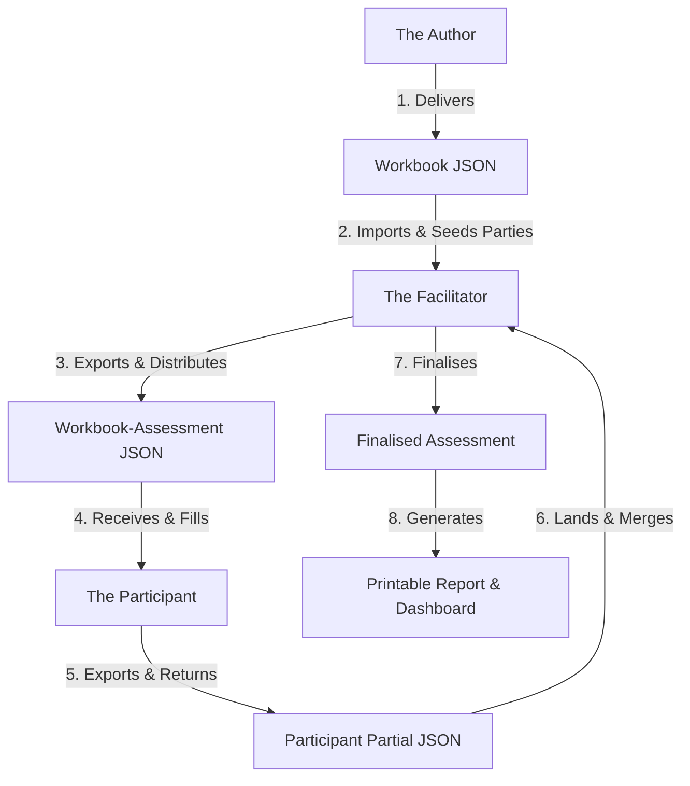

# Cloud Sovereignty Self-Assessment Overview

The Cloud Sovereignty Self-Assessment platform is an offline, workshop-oriented tool. It helps organisations evaluate and document their sovereignty exposure. 

This platform adapts the European Commission's Cloud Sovereignty Framework (CSF). The framework is a reference for good practice, not a compliance target.

---

## Three Key Personas & Workflow Flow

The platform serves three distinct people in three distinct situations:

1. **The Author:** A domain expert who builds the self-assessment instrument (the Workbook). The Author operates in the **Author** application to define objectives, dimensions, questions, rungs, and recommendations.
2. **The Participant:** A knowledge owner who answers questions for the cloud estate. The Participant operates in **Fill** mode of the **Assessment** application. They compose claims and answer only what their claims cover.
3. **The Facilitator:** The workshop manager. The Facilitator operates in the **Assessment** application to prepare the assessment, seed known parties, collect participant files, resolve clashes, and export the finalized assessment.

---

## Two Distinct Outputs

The platform calculates two separate metrics. They never collapse into a single number:

* **SEAL Floor (0–4):** The gating output. It is the minimum level across all material, gating questions. A single low answer can set the overall floor.
* **Sovereignty Score (0–100):** The ranking metric. It is a weighted percentage of earned points out of attainable points. It compares different estates that clear the same SEAL floor.

---

## Honesty in the Data Model

The platform captures the true state of knowledge in the workshop:

* **Nobody Knows:** Indicates asserted ignorance. This state is excluded from scores but counts toward the unknown count of the SEAL floor (for example, `SEAL-2 and 3 unknowns`).
* **Doesn't Apply:** Used when a question cannot apply to a specific unit. This state is excluded from scores and floors.
* **Evidence Notes:** Concise descriptions of checkable sources. Every high-SEAL answer requires evidence to be defensible.
