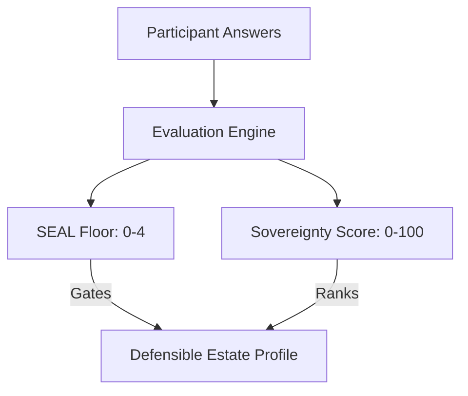

# Sovereignty Scoring Model

The evaluation engine separates gating metrics from ranking metrics. They are calculated independently.

## 1. Gating: The SEAL Floor (0–4)

The **SEAL Floor** measures the absolute minimum level of sovereignty established across the estate.

### The Minimum Rule
* An objective's SEAL is the **minimum** of its material, gating answers.
* The overall estate SEAL is the **minimum** of all objective SEALs.
* **The floor does not average.** A single material SEAL-0 answer takes the overall floor to SEAL-0.

### Critical Dimensions
Questions on the dimension grain only gate the SEAL floor if they cover a **critical dimension** (for example, Compute or Storage, as marked by the author). Answers on non-critical dimensions do not affect the SEAL floor.

## 2. Ranking: The Sovereignty Score (0–100)

The **Sovereignty Score** is a continuous ranking metric. It compares different estates that clear the same SEAL floor.

### Calculation
1. Each ladder rung carries an **authored point value**.
2. A question's **attainable points** are the points of its highest rung.
3. For each objective, the engine calculates the ratio of earned points to attainable points.
4. The overall score is the weighted sum of these ratios, re-normalised over the covered weight, and scaled from 0 to 100.

## 3. Answer States and Scoring

The table below describes how the engine treats different answer states:

| Answer State | Effect on SEAL Floor | Effect on Sovereignty Score |
|---|---|---|
| **Answered** | Gates the floor if the question is material and gating. | Earns the chosen rung's points. |
| **Nobody Knows** | Excluded from the minimum, but adds to the floor's **unknown count** (for example, `SEAL-2 and 3 unknowns`). | Excluded from both earned and attainable points. |
| **Doesn't Apply** | Excluded entirely. | Excluded from both earned and attainable points. |
| **Unanswered** | Does not gate yet (the dataset is incomplete). | Earns 0 points, but attainable points remain. |

## 4. The Convergence Contract

When evaluating incomplete assessments (where some units are unanswered), the engine follows two safety rules:

* **The Floor Only Falls:** A SEAL floor calculated on an incomplete dataset is an **upper bound**. As more answers land, the floor can only stay the same or decrease.
* **The Score Moves Both Ways:** The Sovereignty Score only converges upward while the set of units is fixed. If you add a new third-party provider, the score can decrease because the provider adds new attainable points.
